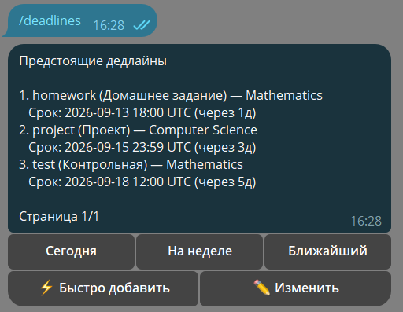
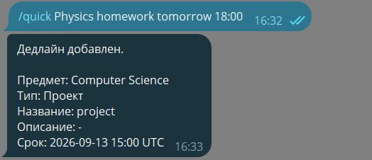
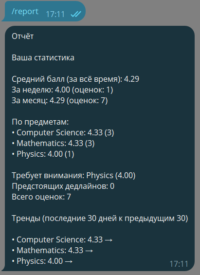
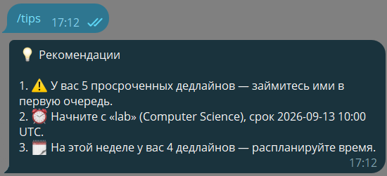
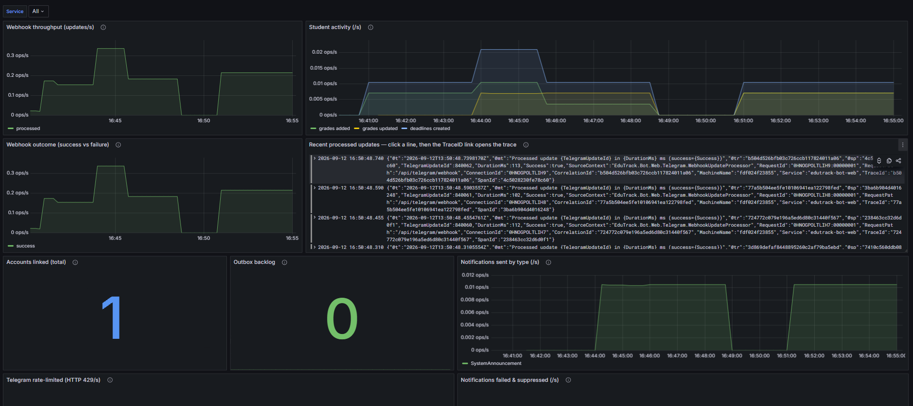
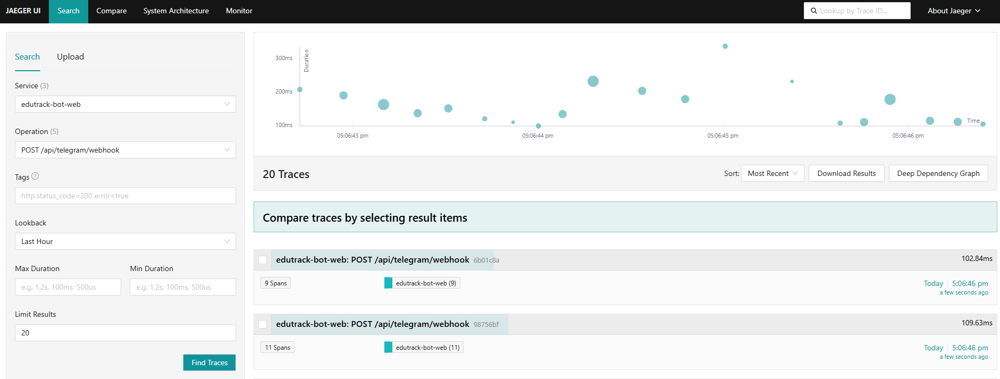

# GradeTracker (EduTrack)

A Telegram bot for students to track grades, GPA and deadlines, built as a
production-grade **.NET 8** modular monolith with a full observability and
deployment stack. Students link their account with an invite code and manage
everything through inline-keyboard conversations; a background worker delivers
reminders and notifications. 

For how to run it, see **[USAGE.md](USAGE.md)**.

---

## Features

- **Account linking** — students bind their Telegram account with an invite code (`/bind`); role-based access (Student / Admin).
- **Grades & GPA** — add, edit and view grades by subject from the `/grades` menu; automatic weighted GPA, a full performance snapshot with per-subject trends via `/report`, and personalised advice via `/tips`.
- **Deadlines** — add, edit and view assignments from the `/deadlines` menu (today / this week / nearest filters); one-line natural-language capture with `/quick` (e.g. "Physics homework tomorrow 18:00"); recurring deadlines; hide and restore old items with `/archive`; and `/export` to an `.ics` calendar file.
- **Change history** — `/history` shows the student's own recent grade and deadline changes.
- **Reminders & notifications** — a background worker schedules and delivers reminders, honouring quiet hours; each student tunes their own notifications, morning digest, quiet hours, time zone and language via `/settings`.
- **Bilingual (RU/EN)** — the bot replies in the user's language, chosen in `/settings` (falling back to the Telegram client language), via a `.resx`-backed translation layer.
- **Admin tools** — the `/admin` menu manages users and roles, invite codes, subjects, broadcast announcements, the audit log and system status.
- **Reliable webhook** — idempotent update processing (inbox pattern): a redelivered Telegram update is never handled twice.
- **Full observability** — structured logs, metrics dashboards, distributed traces, and trace-to-logs correlation.
- **Production-ready** — one-command Docker deployment with automatic HTTPS, scheduled database backups and CI/CD.

---

## Screenshots

The bot in action, and the observability stack behind it.

| | |
| :---: | :---: |
|  |  |
| **`/deadlines`** — inline hub: today / this week / nearest filters, quick-add, edit. | **`/quick`** — free text → subject, type and due date, ready to confirm. |
|  |  |
| **`/report`** — weighted GPA, per-subject breakdown and trends. | **`/tips`** — personalised recommendations (overdue, slipping subjects, weekly load). |

**Grafana — GradeTracker Overview**



**Jaeger — one webhook update, end to end**



---

## Tech stack

**Language & platform**
- C# / .NET 8

**Architecture**
- Clean Architecture · Modular Monolith · CQRS (MediatR) · FluentValidation · Result/Error pattern

**Data & messaging**
- PostgreSQL (EF Core, migrations, transactional outbox) · Redis (conversation state) · RabbitMQ + MassTransit

**Integration**
- Telegram.Bot (webhook)

**Observability**
- Serilog (structured JSON logs) · OpenTelemetry (traces + metrics) · Prometheus · Grafana · Jaeger · Loki + Promtail

**Deployment**
- Docker Compose · Caddy (automatic Let's Encrypt TLS) · GitHub Actions CI/CD · GHCR images

**Testing**
- xUnit · FluentAssertions · NSubstitute — a fast, self-contained suite

---

## Project layout

```
src/
  EduTrack.Domain/                     # entities, value objects, domain rules
  EduTrack.Application/                # CQRS handlers, ports, validation
  EduTrack.Infrastructure.Persistence/ # EF Core, migrations, outbox, inbox, health
  EduTrack.Infrastructure.Messaging/   # RabbitMQ / MassTransit
  EduTrack.Infrastructure.Telegram/    # Telegram.Bot integration
  EduTrack.Infrastructure.Scheduling/  # reminder scheduling
  EduTrack.Infrastructure.Observability/ # Serilog, OpenTelemetry, metrics
  EduTrack.Bot.Web/                    # webhook host, health checks, migrations
  EduTrack.Worker/                     # background reminders / notifications
tests/                                 # unit, application, and bot-module tests (no Docker needed)
ops/                                   # Caddy, otel-collector, Prometheus, Grafana, Loki, Promtail config
docker/                                # Dockerfiles + compose overlays (base, dev override, prod, monitoring)
```

---

## Learning goals

This project is a vehicle for practising, end to end:

- **Clean, layered architecture** with strict dependency direction and CQRS.
- **Domain modelling** of a real workflow (grades, deadlines, roles, reminders).
- **Reliable messaging** — transactional outbox and an idempotent inbox for exactly-the-right-once processing.
- **Observability in depth** — metrics, traces and logs wired together (trace-to-logs correlation), not bolted on.
- **Production deployment** — containerisation, reverse proxy with TLS, secrets via environment, backups.
- **A pragmatic testing strategy** — layered unit, application and bot-module tests that run fast and self-contained.
- **CI/CD** — automated build, test and image publishing.
